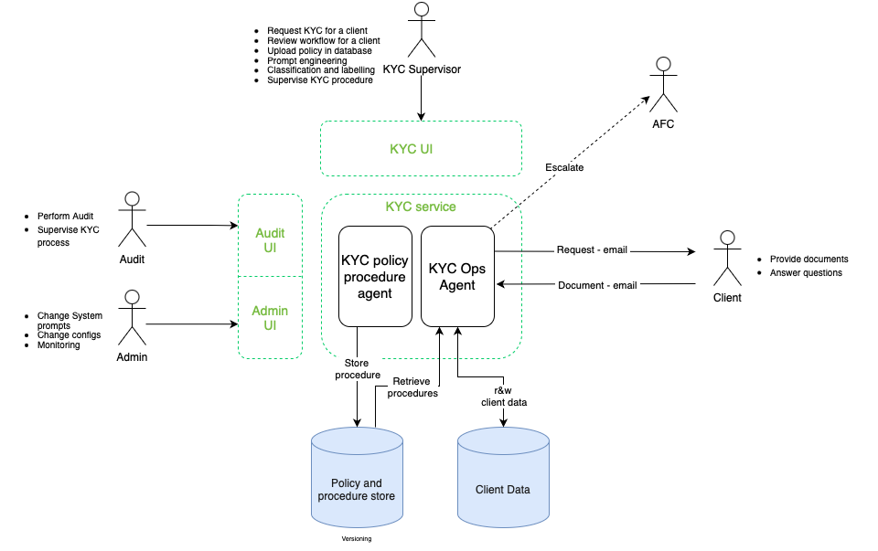
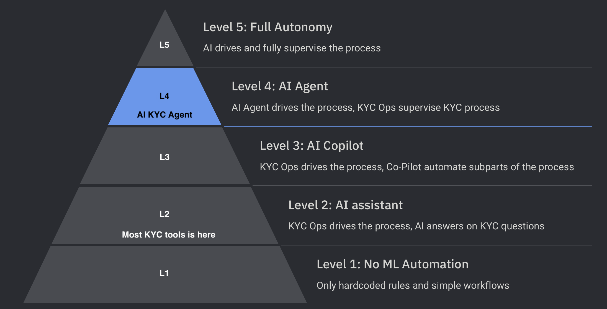

[](https://finosfoundation.atlassian.net/wiki/display/FINOS/Incubating)

# FINOS DTCC Hackathon 


<div align="center">

# **KYC Agent: Automate Routine work of KYC process**

🔎 **AI KYC AGENT**: An innovative AI-powered KYC agent that streamlines KYC processes, reduces costs, and enhances compliance. The financial industry is increasingly reliant on Know Your Customer (KYC) processes to mitigate risk and comply with regulations. This provides an alernative to traditional KYC methods which are often manual, time-consuming, and prone to errors. 

</div>

### Disclaimer

This repository contains an experimental AI-powered KYC (Know Your Customer) agent developed as part of a hackathon project. It is intended solely as a technology showcase and does not represent or reflect any actual KYC processes, policies, or compliance requirements of any organization, financial institution, or regulatory body.

This project is provided as-is, without any warranties or guarantees regarding accuracy, security, or compliance with legal and regulatory frameworks. It should not be used in any production environment or relied upon for real-world identity verification or fraud prevention.

By using this repository, you acknowledge that:

This project is for demonstration and educational purposes only.
The authors, contributors, and maintainers are not responsible for any misuse, legal implications, or consequences arising from its use.
It is your responsibility to ensure compliance with applicable laws and regulations before implementing any KYC-related solutions.
For any concerns or inquiries, please refer to the repository's license terms and contribution guidelines.


## Table of contents 

- [Why AI KYC Agent?](#why-ai-kyc-agent)
- [Getting Started](#getting-started)
- [Key Features](#key-features)
- [Examples](#examples)
- [How AI KYC AGENT Compares](#how-ai-kyc-agent-compares)
- [Frequently Asked Questions (FAQ)](#faq)
- [Contribution](#contribution)
- [Project Members](#project-members)
- [License](#license)

# Why AI KYC Agent?

### Why Is KYC Important?
Know Your Customer (KYC) processes are essential in the financial industry to prevent fraud, money laundering, and other illicit activities. Regulatory compliance ensures that businesses operate within legal frameworks, protecting both institutions and customers from financial crimes.

### The Problem with Manual KYC
Traditional KYC methods rely heavily on manual reviews, which come with several challenges:
- Time-Consuming – Verifications often take days, delaying customer onboarding.
- High Costs – Labor-intensive processes lead to increased operational expenses.
- Error-Prone – Human oversight can result in inconsistencies, leading to compliance risks.
- Scalability Issues – As customer bases grow, manual processes struggle to keep up.

### How This Solves These Challenges
Our AI-powered KYC agent offers a smarter alternative by:
- ✅ Reducing Costs – Eliminating the need for extensive manual labor.
- ✅ Enhancing Compliance – Ensuring accuracy and adherence to regulatory requirements.
- ✅ Scaling Efficiently – Handling large volumes of customers without sacrificing quality.
- ✅ Automating Documentation Processing – Faster processing with real-time processing.

By leveraging advanced AI, this solution transforms KYC into a streamlined, cost-effective, and highly compliant process—empowering businesses to operate more efficiently in an increasingly regulated landscape.

# Getting started 
AI KYC AGENT has two flows which act as a comprehensive KYC Agent. The first flow is a KYC procedure Agent, to analyse Policy Documents via the KYC Procedure agent. The second flow to analyse Client Documentation via the KYC Ops Agent. 

### 1. Installation

Make sure you have Python 3.10 or later installed on your system, as well as a Postgress instance. 

To install the required for frontend dependencies, naviagte to the directory and install requirements:

```shell
cd kyc-ui-dashboard
```

```shell
pip install -r requirements.txt
```

To install the required for backend dependencies, naviiagte to the directory and install requirements:
```shell
cd ..
cd llm_agent_workflows
```

```shell
pip install -r requirements.txt
```

Install Pytesseract, follow the steps listed in [Pytesseract README](./README_pytesseract.md).

Create the tables to store all your objects by running the folloing script [Database Schemas](./database/ddl.sql).

For the email web backend run the folloing script [Database Schemas](./web-backend/schema.sql).

### 2. Setting your environmet 

Ensure you're in the maion directory and copy and fill in your own corresponding environment variables.

```bash
cp .env.template .env
```

Fill in the config.py from the web backend. 
```bash
cd web-backend
config.py 
```


### 3. Running Your AI KYC AGENT

1. Run the frontend:

    ```bash
    cd kyc-ui-dashboard
    npm run start
    ```

2. Run the email service 

    ```bash
    cd web-backend
    python run.py
    ```


# Functionality

## Key Features (work in progress)
* Perform E2E KYC for a client
    * Request information from a client
    * Extract information from client messages and documents
    * Perform risk assessment 
    * Provide summarisation of the client risk and risk matrix
    * Support 4-eyes review
    * Escalate risk to AFC
* Reassess risks for all clients affected by changed policies 
* Transparency and explainability on every step, fully audit-friendly
## Overview diagram




## Autonomy diagram
This diagram illustrates the current level of autonomy in the KYC landscape. As shown below, autonomy is categorized into five levels. It is important to note that most existing KYC tools fall under Level 1 or 2, where KYC Operations drive the process, potentially with AI answering KYC-related questions. This solution aims to achieve Level 4, where an AI Agent can manage the entire process, with KYC Operations providing supervision.



# Examples 
A demo of the AI KYC AGENT use case is provided below:
> TODO: add gif / video


# Contribution
We welcome contributions to this project! Whether you're fixing a bug, adding a new feature, or improving the documentation, we appreciate your help in making this project better.

For detailed information on how the system is architected, how features are implemented, and the technologies used, please refer to the [TECHNICAL.md](./TECHNICAL.md) file. Before contributing, we recommend reviewing this document to familiarize yourself with the project’s technical setup and coding standards.

# Project Members 
Team members involved in the DTCC Hackathon with FINOS, resposible for the initial PoC of the AI KYC AGENT. 


**Team Member**     | **Title**              | **Resposible Topics**  
------------------  | ---------------------- | ------------------  
Maxim Romanovsky    | Team Lead              | All areas
Haydn Griffith-Jones| Product Owner          | Product 
Valeria Bladinieres | ML Engineer     | RAG, Agent, Frontend, CI/CD 
Matthew Barley      | ML Engineer            | Agent, RAG, Prompt Engineering
Pulkit Khera        | ML Engineer            | Data pipelines, RAG, CI/CD
Alessio Sordo       | ML Engineer            | Evaluation framework, Agent, Backend, Prompt Engineering
Meeka Lenisa        | Data Scientist         | Product, Evaluation Framework, Prompt Engineering
Nikolay Tolstokulakov | Fullstack Engineer       | CI/CD, Backend, RAG
Somnath Pailwan     | Fullstack Engineer     | Frontend, Backend, CI/CD
Elena Podgornova    | Fullstack Engineer     | Backend, Frontend, CI/CD


# License

Copyright 2025 FINOS

Distributed under the [Apache License, Version 2.0](http://www.apache.org/licenses/LICENSE-2.0).

SPDX-License-Identifier: [Apache-2.0](https://spdx.org/licenses/Apache-2.0)


