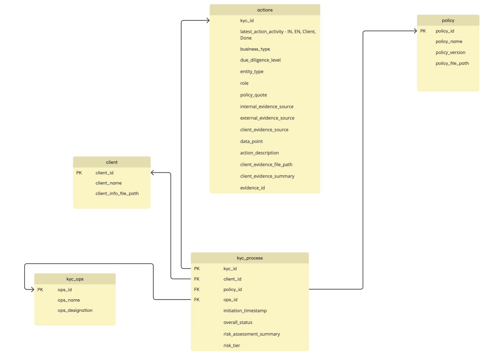

# Technical Documentation  

## Project Name
KYC Agent: Automate Routine work of KYC process

## Disclaimer

This repository contains an experimental AI-powered KYC (Know Your Customer) agent developed as part of a hackathon project. It is intended solely as a technology showcase and does not represent or reflect any actual KYC processes, policies, or compliance requirements of any organization, financial institution, or regulatory body.

This project is provided as-is, without any warranties or guarantees regarding accuracy, security, or compliance with legal and regulatory frameworks. It should not be used in any production environment or relied upon for real-world identity verification or fraud prevention.

By using this repository, you acknowledge that:

This project is for demonstration and educational purposes only.
The authors, contributors, and maintainers are not responsible for any misuse, legal implications, or consequences arising from its use.
It is your responsibility to ensure compliance with applicable laws and regulations before implementing any KYC-related solutions.
For any concerns or inquiries, please refer to the repository's license terms and contribution guidelines.

## Overview  

This document provides an in-depth technical overview of the **AI KYC Agent**, an advanced AI-powered system designed to streamline Know Your Customer (KYC) processes. The AI KYC Agent leverages automation, machine learning, and natural language processing to enhance efficiency, reduce costs, and ensure regulatory compliance.  

This documentation serves as a guide for engineers, developers, and contributors, detailing the system architecture, data structures, technologies used, and deployment instructions. It also includes insights into how features are implemented, along with guidelines for contributing to the project.  


## Table of Contents  

- [Solution Architecture](#solution-architecture)  
- [Solution Structure](#solution-structure)  
- [Technology Stack](#technology-stack)  
- [Functionality Diagrams](#functionality-diagrams)  
- [Data Structure](#data-structure)  
- [Components](#components)  
- [Feature Roadmap](#feature-roadmap)  
- [How to Deploy](#how-to-deploy)  
- [Contributing to the Project](#contributing-to-the-project)  
  - [How to Contribute](#how-to-contribute)  
  - [Code Review Process](#code-review-process) 
- [DCO to sign commits](#using-dco-to-sign-your-commits)


## Solution Architecture
This section includes a high-level design diagram illustrating the overall structure of the solution. The diagram below outlines the logical flow of the two processes, which are explained in detail in the [Solution Structure](#solution-structure) section. 


## Solution Structure
### The structure consists of two processes:
- **KYC Policy Procedure**: This is the process to extract KYC information from policies (LLM-based). This involves breaking down policy documents into manageable sections. During this step, we identify actions, data points, and variables, then map them to the corresponding policy quotes.
- **KYC Ops Process**: This refers to the workflow for managing client information. It involves requesting the relevant data needed to match and map to the relevant identified data points.

### 1. KYC Policy Procedure
From relevant policy documents we want to extract data to end up with a set of KYC actions and variables related to them.

1. Identify **Sections** that contain requirements in the policy (Matthew)
2. Section ->  **Actions** (aka KOS or requirements) -> **Data points**
    1. Separate sentences 
    2. Check if the sentence is an action 
    3. Check if the action is KYC relevant 
    4. Extract data points from actions (e.g. from action "Collect middle name of senior manager" -> "middle name") -> we already have a template of data points, which may be incomplete 
    5. Verify if more data points emerge from the action 
    6. In case they do, we should add them to the template 
3. Pull out from those actions and data points:
    1. The **Variables** (e.g. from "Collect middle name of senior manager" the role should be "middle manager") -> we have a <u>fixed list</u> of needed variables 
    2. The **Type of Evidence** we should request to satisfy that data point 
4. **Output CSV** with section numbers, actions, data points and variables  (should be versioned, at least in the filename)
5. **Call the backend** POST route to save document in S3 and map them to database
6. [[Roadmap Stage 2 - Planned Features](#stage-2---planned-features)] - **Human Reiteration Loop** : An admin should be added in the loop to supervise the steps. This can be modeled an **Accept/Refuse** UI button after each step 1-4. We need to decide what action the user can take in case they refuse. Current options are:
- Change of prompt
- Change of generated outputs (which will always be in xlsx format)

### 2. KYC Ops Process 
1. Background check with **X policy for Y client** (triggered by KYC-ops) 
2. Obtain **Evidence**. Sources ordered by priority:
    1. Internal -> From database with API
    2. Public -> [[Roadmap Stage 2 - Planned Features](#stage-2---planned-features)]: To be able to check Public Sources for publicly availible documnetation. 
    3. Client -> Provided by users via email
    - Two types of **integrations**:
        1. Internal tools (DB)
        2. Ask client via email (Automated)
    - [[Roadmap Stage 2 - Planned Features](#stage-2---planned-features)] - **Reiteration for extra Data Points**: Check for additional variables that may become apparent only after checking initital evidence (e.g. requested full name and passport as evidence, after passport uploaded check the eventual actions that apply to that specific country and ask for more data).
3. **Identify risks** by interpreting correpsonding client information the to the datapoint. 
4. **Reporting**
    1. Summary of risks
    2. Matrix of risks (True/False)

## Technology Stack
This section outlines the technologies used throughout the project, including programming languages, frameworks, databases, and cloud services. While specific tools have been tested and used in development, where applicable, alternative technologies may be compatible.  

- **Backend**: Python
- **Frontend**: React.JS
- **Database**: Postgress
- **Agent**: Custom Agent
- **LLM**: Claude Sonnet 3.5 (tested on, but compatible with any LLM with reasoning ability)
- **Cloud Provider**: AWS Bedrock


## Functionality Diagrams
The below diagram that showcase the flow of functionalities and the interaction between different components of the system. This diagram shows the ways in which the KYC Agent can be interacted with. As detailed in the [Solution Structure](#solution-structure) section, there are two flows, each with their own agent. The KYC Policy Procedure Agent is responsible for the first flow, namely the KYC Policy Procedure, which maps the policy documents. The KYC Ops Agent is responsible for the second flow, namely the KYC Ops Process, where the client specific data is managed. The corresponding UIs and stakeholders are also shows in this diagram.


## Data Structure

In this section, we outline the structure of the data used within the system. The data is organized into tables, each with specific entries that relate to various aspects of the system's functionality. Below is a high-level overview of the data flow, with tables and entries mapped to the relevant parts of the application.




### Key Data Tables:
1. **Actions Table**: For each KYC process, there are multiple actions which relate to it. This table contains the Action Description and its corresponding data point. It also contains the latest action activity, correspinding to the evidence sources, Internal, External and Client. It also contains the corresponding variables, which are stored as lists of the values. 
2. **KYC Process Table**: Tracks all KYC process in place. It maps the KYC Process with the Client ID, Policy ID and Ops ID. It also includes the initiation time stamp and Overall Status of the KYC proces. 
3. **KYC Ops Table**: Stores the KYC Operations details, including the ID, Name and Designation. 
4. **Client Table**: Stores client information, including Client ID, Client Name and the file path of the client. 
5. **Policy Table**: Stores policy information, including Policy ID, Policy Name, Policy Version and the file path of the policy. 


## Components
List and explain the major components or modules of the system. Each component can be linked to its implementation in the codebase.

### Example:
- **.. Module**: Handles user ..
- **...**: Integrates ...
- **Email Service**: Sends ...

## Feature Roadmap
List and describe the key features that are implemented or planned. This will help developers and contributors understand the scope of each feature.

### Stage 1 - Implemented Features:
- **....**: ....
- **....**: ....

Following the successful implementation of Stage 1, we have outlined a set of additional features for Stage 2 to further enhance functionality and performance. These planned features have been stipulated in the [Project Structure](#the-structure-consists-of-two-processes) and aim to build on the existing foundation, addressing key improvements and expanding capabilities. 

### Stage 2 - Planned Features:
- **Human Reiteration Loop**: An admin should be added in the loop to supervise the steps. This can be modeled an accept/refuse UI button after each step 1-4. We need to decide what action the user can take in case they refuse. Current options are:
    - Change of prompt
    - Change of generated outputs (which will always be in xlsx format)
- **Obtain Public Evidence**: As a second priority to internal data, before clients are asked for data it should be able to check Public Sources for publicly availible documnetation.  
- **Reiteration for extra Data Points**: A check for additional variables that may become apparent only after checking initital evidence (e.g. requested full name and passport as evidence, after passport uploaded check the eventual actions that apply to that specific country and ask for more data).

## How to Deploy
Provide instructions for setting up and deploying the application in a local or production environment.

### Example:
1. Clone the repository: 
    ```bash
    git clone https://github.com/yourusername/repository-name.git
    ```
2. Install dependencies: 
    ```bash
    npm install
    ```
3. Set up environment variables as needed.
4. Run the application locally:
    ```bash
    npm start
    ```
5. For production deployment:
    - Dockerize the application
    - Use CI/CD pipelines for auto-deployment to AWS, Azure, etc.

---

# Contributing to the Project

If you are interested in contributing, here's a guide to get started:

## How Features Were Implemented
Provide a summary or technical overview of how features were built. This section can include the methodology, any frameworks used, testing approaches, and decisions made during implementation.

### Example:
- **Feature 1**: Brief explanation of the feature, the components it touches, and the reasoning behind implementation choices.
- **Feature 2**: Same as above.

## How to Contribute
1. Fork the repository.
2. Clone your fork:
    ```bash
    git clone https://github.com/yourusername/repository-name.git
    ```
3. Create a new branch for your feature:
    ```bash
    git checkout -b feature/your-feature
    ```
4. Implement the feature and write tests.
5. Run all tests to ensure everything works.
6. Push the changes to your fork:
    ```bash
    git push origin feature/your-feature
    ```
7. Create a pull request describing the changes.

## Code Review Process
Explain the process for code reviews, including any guidelines or checks that need to be followed.


## Using DCO to sign your commits

**All commits** must be signed with a DCO signature to avoid being flagged by the DCO Bot. This means that your commit log message must contain a line that looks like the following one, with your actual name and email address:

```
Signed-off-by: John Doe <john.doe@example.com>
```

Adding the `-s` flag to your `git commit` will add that line automatically. You can also add it manually as part of your commit log message or add it afterwards with `git commit --amend -s`.

See [CONTRIBUTING.md](./.github/CONTRIBUTING.md) for more information

### Helpful DCO Resources
- [Git Tools - Signing Your Work](https://git-scm.com/book/en/v2/Git-Tools-Signing-Your-Work)
- [Signing commits
](https://docs.github.com/en/github/authenticating-to-github/signing-commits)


## License

Copyright 2025 FINOS